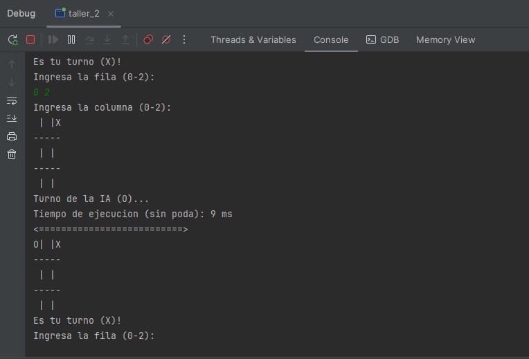
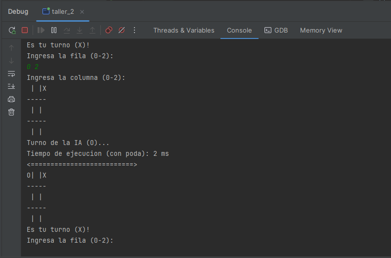

# Taller 2

## Alumnos
- **Nombre:** Gustavo Ferreira de Oliveira
- **RUT:** 400162816

## Estructura del proyecto

El proyecto está dividido en los siguientes paquetes:

```
📁 taller-2/
│
├── 📁 src/               
│   ├── 📁 model
│   │     ├── 📁 minimax
|   |     ├── 📁 nodo
│   │     └── 📁 tablero
│   └── 📄 main.cpp
└── 📄 README.md
```

## **Explicación teórica del algoritmo**

El algoritmo **Minimax** es una técnica utilizada en teoría de juegos para encontrar el movimiento óptimo en juegos de dos jugadores con información perfecta, como el ajedrez o el tres en raya.  
- **Minimizador y maximizador:** Cada jugador intenta maximizar su ganancia (jugador maximizador) o minimizar su pérdida (jugador minimizador).  
- **Evaluación de estados:** El algoritmo evalúa el tablero en los nodos hoja del árbol de juego y propaga los valores hacia arriba, eligiendo el mejor movimiento para el jugador actual.  
- **Poda alfa-beta:** Mejora la eficiencia al descartar ramas del árbol que no afectan al resultado final, reduciendo el número de nodos evaluados.  


## **Ejemplos prácticos y análisis de casos simples**

### **Caso 1: Sin poda alfa-beta**
En este caso, el algoritmo explora todas las combinaciones posibles hasta alcanzar la profundidad máxima definida, evaluando cada rama completa del árbol de juego.

- **Ejemplo práctico:**  
  Supongamos que el tablero tiene 3 movimientos posibles: A, B, C. El algoritmo evaluará cada una de las combinaciones completas:
   - **Movimiento A:** Se evalúan todas las jugadas futuras desde esta posición hasta el límite de profundidad.
   - **Movimiento B:** Se evalúan todas las jugadas futuras desde esta posición hasta el límite de profundidad.
   - **Movimiento C:** Se evalúan todas las jugadas futuras desde esta posición hasta el límite de profundidad.

El análisis considera cada posible combinación completa de movimientos sin optimizar la búsqueda. Esto puede ser costoso en términos de tiempo computacional, especialmente en tableros complejos.

### **Caso 2: Con poda alfa-beta**
En este caso, la poda alfa-beta optimiza la búsqueda al eliminar partes del árbol de juego que no afectan la decisión final. Esto se logra comparando los valores actuales de alfa y beta, lo que permite detener la exploración cuando no es necesario continuar evaluando.

- **Ejemplo práctico:**  
  Supongamos que el tablero tiene 3 movimientos posibles: A, B, C. Con la poda alfa-beta, la búsqueda se detendría de manera anticipada para algunos movimientos:
   - **Movimiento A:** Se evalúa hasta que un valor determina que no es necesario continuar más allá de ese camino.
   - **Movimiento B:** Se descarta tempranamente porque no mejora el valor actual de alfa o beta.
   - **Movimiento C:** Se analiza solo lo necesario, gracias a la poda, limitando la cantidad de ramas evaluadas.

De esta manera, la poda alfa-beta ahorra tiempo al evitar la evaluación de ramas que no tienen un impacto en el resultado final, reduciendo significativamente el espacio de búsqueda en comparación con la evaluación exhaustiva.

### **Caso 3: Movimiento en escenarios competitivos con patrones de empate**
En situaciones donde el tablero está cerca de un estado de empate, tanto el algoritmo con poda alfa-beta como el sin poda pueden analizar patrones similares. Sin embargo:
- Sin poda, el análisis recorrería todas las ramas hasta llegar a una conclusión.
- Con poda alfa-beta, el análisis se detendría más rápido al identificar una serie de movimientos que garantizarían un empate sin necesidad de exhaustividad.

Esto puede ser útil para juegos con múltiples rutas hacia un empate.

### **Caso 4: Análisis en tableros complejos con más movimientos posibles**
En escenarios con múltiples opciones de movimiento:
- Sin poda alfa-beta, el algoritmo tendría que evaluar todas las combinaciones posibles, lo que puede resultar en un rendimiento lento o poco eficiente.
- Con poda alfa-beta, el árbol de juego es reducido a las ramas más relevantes. Por ejemplo:
   - Solo se evalúan los movimientos que tienen potencial de cambiar el resultado actual.
   - Se descartan movimientos redundantes que no afectan la decisión de la IA.

Este enfoque es más eficiente en términos computacionales, especialmente en juegos con más de 9 casillas (tableros más grandes).

## **Explicación de la búsqueda en el árbol de juego y su evaluación**

1. **Construcción del árbol:**  
   Cada nodo representa un estado del tablero, y las ramas representan movimientos posibles.

2. **Propagación de valores:**  
   Desde los nodos hoja hacia arriba, el jugador maximizador elige el valor máximo y el minimizador elige el valor mínimo.

3. **Optimización con poda alfa-beta:**
    - **Alfa:** Mejor valor garantizado para el maximizador.
    - **Beta:** Mejor valor garantizado para el minimizador.  
      Si beta ≤ alfa, se detiene la evaluación de esa rama.

4. **Optimización sin poda alfa-beta:**
    - En la versión sin poda, el algoritmo evalúa exhaustivamente todos los nodos posibles del árbol hasta la profundidad máxima.
    - Aunque asegura que siempre se encuentra la mejor decisión, este enfoque tiene un alto costo computacional, ya que no descarta movimientos irrelevantes.
    - **Desventajas:**
        - Es ineficiente para juegos con árboles de gran profundidad.
        - Consume más tiempo y recursos al explorar ramas redundantes.
    - **Caso de uso:**
        - Se utiliza principalmente en implementaciones iniciales o cuando el árbol de juego tiene un factor de ramificación bajo y poca profundidad.

### **Explicación detallada del código y ejemplos**

El código presentado implementa el algoritmo **Minimax** para el juego del Tic-Tac-Toe, tanto con como sin la optimización de poda alfa-beta. A continuación, se detalla cómo funciona cada parte del código con ejemplos prácticos para comprender su comportamiento.

---

### **1. Evaluar el estado del tablero**
La función `evaluar` determina el puntaje del tablero en función del ganador. Esto es esencial para que el algoritmo minimax identifique qué movimientos son mejores.

```cpp
int Minimax::evaluar(const Tablero& tablero, char jugador) {
    char ganador = tablero.verificarGanador();
    if (ganador == jugador) return 1;         // Ganó el jugador actual.
    if (ganador == 'O' && jugador == 'X') return -1; // Ganó el oponente.
    return 0;                                // Empate o no hay ganador.
}
```

#### **Ejemplo:**
- **Tablero actual:**
```
X | O | X  
O | X | O  
O |   | X  
```
- **Jugador:** `X`
- Resultado: `1` (El jugador `X` ganó).


### **2. Construcción del árbol de posibilidades**
La función `construirArbol` genera todas las posibles combinaciones de movimientos hasta una profundidad dada.

```cpp
void Minimax::construirArbol(Nodo& nodo, const Tablero& estado, int profundidad) {
    if (profundidad == 0 || estado.verificarGanador() != ' ') return;

    auto coordenadas = estado.obtenerCoordenadasDisponibles();
    for (const auto& coordenada : coordenadas) {
        Tablero nuevoEstado = estado;
        nuevoEstado.realizarMovimiento(coordenada.first, coordenada.second, nodo.jugador);

        Nodo nuevoNodo(coordenadas, nodo.jugador == 'X' ? 'O' : 'X');
        nodo.movimientos.push_back(nuevoNodo);

        construirArbol(nodo.movimientos.back(), nuevoEstado, profundidad - 1);
    }
}
```

#### **Ejemplo:**
- **Estado inicial del tablero:**
```
X | O | X  
O |   |  
  |   |  
```
- **Movimiento disponible:** `(1, 1)`
- El árbol generará posibles tableros con combinaciones a partir de este estado.

### **3. Minimax sin poda alfa-beta**
Este método explora **todas** las ramas posibles para encontrar el mejor movimiento.

```cpp
int Minimax::minimaxSinPoda(Nodo& nodo, const Tablero& estado, int profundidad, bool esMaximizador) {
    if (profundidad == 0 || estado.verificarGanador() != ' ') {
        return evaluar(estado, nodo.jugador);
    }

    int mejorPuntuacion = esMaximizador ? numeric_limits<int>::min() : numeric_limits<int>::max();
    auto coordenadas = estado.obtenerCoordenadasDisponibles();

    for (const auto& coordenada : coordenadas) {
        Tablero nuevoEstado = estado;
        nuevoEstado.realizarMovimiento(coordenada.first, coordenada.second, nodo.jugador);

        Nodo nuevoNodo(coordenadas, nodo.jugador == 'X' ? 'O' : 'X');
        int puntuacion = minimaxSinPoda(nuevoNodo, nuevoEstado, profundidad - 1, !esMaximizador);

        if (esMaximizador) {
            mejorPuntuacion = max(mejorPuntuacion, puntuacion);
        } else {
            mejorPuntuacion = min(mejorPuntuacion, puntuacion);
        }
    }

    return mejorPuntuacion;
}
```

#### **Ejemplo:**
1. **Estado inicial:**
```
X | O | X  
O |   |  
  |   |  
```
2. El algoritmo evalúa cada posible movimiento en profundidad 3.
3. Retorna el movimiento con la mayor puntuación para el jugador actual.

### **4. Minimax con poda alfa-beta**
Este método optimiza la búsqueda descartando ramas innecesarias cuando `β ≤ α`.

```cpp
int Minimax::minimaxComPoda(Nodo& nodo, const Tablero& estado, int profundidad, bool esMaximizador, int alfa, int beta) {
    if (profundidad == 0 || estado.verificarGanador() != ' ') {
        return evaluar(estado, nodo.jugador);
    }

    int mejorPuntuacion = esMaximizador ? numeric_limits<int>::min() : numeric_limits<int>::max();
    auto coordenadas = estado.obtenerCoordenadasDisponibles();

    for (const auto& coordenada : coordenadas) {
        Tablero nuevoEstado = estado;
        nuevoEstado.realizarMovimiento(coordenada.first, coordenada.second, nodo.jugador);

        Nodo nuevoNodo(coordenadas, nodo.jugador == 'X' ? 'O' : 'X');
        int puntuacion = minimaxComPoda(nuevoNodo, nuevoEstado, profundidad - 1, !esMaximizador, alfa, beta);

        if (esMaximizador) {
            mejorPuntuacion = max(mejorPuntuacion, puntuacion);
            alfa = max(alfa, mejorPuntuacion);
        } else {
            mejorPuntuacion = min(mejorPuntuacion, puntuacion);
            beta = min(beta, mejorPuntuacion);
        }

        if (beta <= alfa) break; // Se descarta esta rama.
    }

    return mejorPuntuacion;
}
```

#### **Ejemplo:**
1. **Estado inicial:**
```
X | O | X  
O |   |  
  |   |  
```
2. La poda ocurre si el oponente tiene una estrategia que asegura un mejor resultado sin explorar más.

### **5. Encontrar el mejor movimiento**
Ambas versiones (`sin poda` y `con poda`) determinan el mejor movimiento.

#### **Sin poda:**
```cpp
pair<int, int> Minimax::encontrarMejorMovimientoSinPoda(Tablero& tablero, char jugador) {
    auto inicio = high_resolution_clock::now();
    // Lógica para calcular el mejor movimiento.
    auto fin = high_resolution_clock::now();
    cout << "Tiempo de ejecucion (sin poda): " << duration_cast<milliseconds>(fin - inicio).count() << " ms\n";
    return mejorMovimiento;
}
```

#### **Con poda:**
```cpp
pair<int, int> Minimax::encontrarMejorMovimientoComPoda(Tablero& tablero, char jugador) {
    auto inicio = high_resolution_clock::now();
    // Lógica para calcular el mejor movimiento con poda.
    auto fin = high_resolution_clock::now();
    cout << "Tiempo de ejecucion (con poda): " << duration_cast<milliseconds>(fin - inicio).count() << " ms\n";
    return mejorMovimiento;
}
```

### **6. Resultados esperados**
#### **Sin poda:**



- Tiempo de ejecución: **9 ms** (depende de la complejidad de la jugada).
#### **Con poda:**



- Tiempo de ejecución: **2 ms** (mayor eficiencia).

### **7. Comparativa**

| **Método**            | **Tiempo de Ejecución** | **Eficiencia**        |
|------------------------|-------------------------|------------------------|
| **Sin poda alfa-beta** | 9 ms                   | Menor eficiencia       |
| **Con poda alfa-beta** | 2 ms                   | Mayor eficiencia       |

El uso de la poda alfa-beta optimiza el cálculo, manteniendo el nivel de decisión estratégico del algoritmo. En escenarios más complejos o con juegos más grandes, la diferencia sería aún más significativa.

## **Diagrama del árbol de juego para un caso simple**

El siguiente diagrama ilustra un ejemplo con un tablero de Tic-Tac-Toe donde el jugador `X` realiza los primeros movimientos, y exploraremos los posibles caminos hasta una profundidad definida:

### **Caso inicial: Tablero vacío**
```
Inicio (X)
       ┌───┬───┬───┐
       │   │   │   │
       └───┼───┼───┘
```

### **Primer movimiento del jugador X:**
El jugador `X` tiene varias opciones (A, B, C) al inicio. Cada una lleva a una secuencia de movimientos diferentes.

```
X juega en la posición A (0-0):
       ┌───┬───┬───┐
       │ X │   │   │
       └───┼───┼───┘
```

#### Opciones del oponente (`O`) luego de `X` elige la posición A:
```
O juega en la posición D (1-1):
       ┌───┬───┬───┐
       │ X │   │   │
       └───┼───┼───┘
       │ O │   │   │
```

Al explorar las combinaciones de cada movimiento para determinar el mejor resultado para `X`, el algoritmo recorre los posibles movimientos usando el árbol de búsqueda hasta alcanzar la profundidad máxima.

### Comparativa con poda alfa-beta:

Al aplicar la poda alfa-beta, se corta una parte del árbol de búsqueda si se verifica que un camino no mejora el resultado. Por ejemplo:

```
X juega en la posición A y el oponente O se decide por D, pero se descartan movimientos porque no mejoran el puntaje.
```

Con este método, se reduce el número de nodos evaluados, optimizando así la búsqueda.


### Tabla comparativa para el ejemplo de movimientos

| Movimiento | Estado del tablero | Evaluación (Sin poda) | Evaluación (Con poda) |
|-------------|--------------------|------------------------|------------------------|
| A           | `X` en posición A  | Evaluar todas las combinaciones hasta profundidad máxima | Se corta en los nodos que no impactan el resultado |
| B           | `X` en posición B  | Evaluar todas las combinaciones hasta profundidad máxima | Se corta en algunos caminos gracias a alfa-beta |
| C           | `X` en posición C  | Evaluar todas las combinaciones hasta profundidad máxima | Se corta en algunos caminos gracias a alfa-beta |


## **Análisis de complejidad temporal del algoritmo**
1. **Sin poda alfa-beta:**
    - Complejidad: \( O(b^d) \), donde \( b \) es el factor de ramificación y \( d \) la profundidad máxima.

2. **Con poda alfa-beta:**
    - Complejidad: \( O(b^{d/2}) \) en el mejor de los casos, reduciendo el número de nodos evaluados.

## **Instrucciones para ejecutar**

1. Asegúrate de tener un compilador C++ instalado (como `g++`).
2. Compila el programa con:
   ```bash
   g++ -o minimax main.cpp model/tablero/Tablero.cpp model/nodo/Nodo.cpp model/minimax/Minimax.cpp
   ```

3. Ejecuta el programa:
   ```bash
   ./minimax
   ```